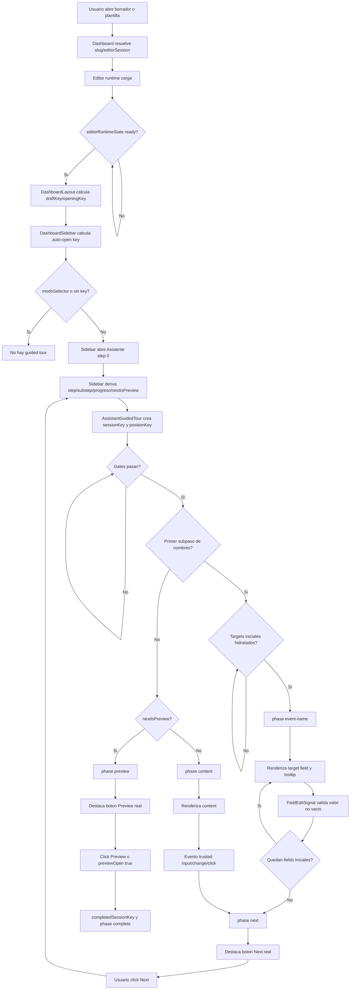
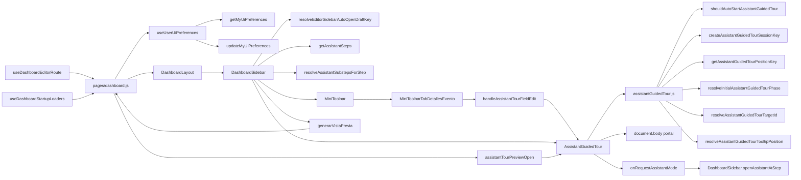

# Guided Tour System

Estado: mapa de implementación actual.

Alcance: esta documentación describe el sistema de visita guiada del Asistente dentro del editor del Dashboard, según el código actual. No define comportamiento deseado ni reemplaza la documentación canónica existente.

## Documentación canónica relacionada

- Índice y convenciones de documentación: [DOCUMENTATION_INDEX.md](../DOCUMENTATION_INDEX.md)
- Arquitectura general del producto, borradores, plantillas y editor: [ARCHITECTURE_OVERVIEW.md](ARCHITECTURE_OVERVIEW.md)
- Sistema del editor y contrato de ownership del Assistant Guided Tour: [EDITOR_SYSTEM.md](EDITOR_SYSTEM.md)
- Estado actual del sistema de interacción: [INTERACTION_SYSTEM_CURRENT_STATE.md](INTERACTION_SYSTEM_CURRENT_STATE.md)
- Modelo de datos: [DATA_MODEL.md](DATA_MODEL.md)
- Análisis del sistema de preview: [PREVIEW_SYSTEM_ANALYSIS.md](PREVIEW_SYSTEM_ANALYSIS.md)
- Contrato de checkout/publicación: [CHECKOUT_PUBLICATION_LIFECYCLE_CONTRACT.md](../contracts/CHECKOUT_PUBLICATION_LIFECYCLE_CONTRACT.md)
- Compatibilidad de render: [RENDER_COMPATIBILITY_MATRIX.md](../contracts/RENDER_COMPATIBILITY_MATRIX.md)
- Mapa de fragilidad sistémica: [SYSTEM_FRAGILITY_MAP.md](SYSTEM_FRAGILITY_MAP.md)

Esta página no duplica esos contratos. Cuando el guided tour toca carga de borradores, persistencia del editor, preview o publicación, esos documentos siguen siendo la fuente canónica.

## Resumen ejecutivo

El guided tour actual es una capa de UI montada sobre el Dashboard/editor. No es un segundo flujo del Asistente y no posee la navegación de pasos. Observa el estado real del Asistente que vive en `DashboardSidebar`, calcula qué elemento DOM debe destacar, posiciona un tooltip y avanza su fase interna cuando detecta acciones del usuario.

La implementación central está repartida entre:

- Dominio puro: [`src/domain/editor/assistantGuidedTour.js`](../../src/domain/editor/assistantGuidedTour.js)
- Overlay React: [`src/components/editor/assistantTour/AssistantGuidedTour.jsx`](../../src/components/editor/assistantTour/AssistantGuidedTour.jsx)
- Estilos: [`src/components/editor/assistantTour/AssistantGuidedTour.module.css`](../../src/components/editor/assistantTour/AssistantGuidedTour.module.css)
- Estado y montaje del Asistente: [`src/components/DashboardSidebar.jsx`](../../src/components/DashboardSidebar.jsx)
- Pasos/subpasos del Asistente: [`src/domain/editor/assistantMode.js`](../../src/domain/editor/assistantMode.js) y [`src/domain/editor/assistantSubsteps.js`](../../src/domain/editor/assistantSubsteps.js)
- Preferencias persistidas: [`src/hooks/useUserUiPreferences.js`](../../src/hooks/useUserUiPreferences.js) y callable functions en [`functions/src/index.ts`](../../functions/src/index.ts)

La única persistencia propia del tour es la preferencia `assistantTourOptOut`. El cierre manual y la finalización del tour existen solo en runtime dentro del componente montado.

## Arquitectura general

El sistema tiene tres capas:

1. Capa de sesión del Dashboard/editor.
   `dashboard.js`, `DashboardLayout`, `useDashboardEditorRoute` y `useDashboardStartupLoaders` determinan qué borrador o plantilla está abierta, cuándo el runtime del editor está listo y si el editor está en modo readonly. Esta capa no conoce las fases internas del tour.

2. Capa del Asistente.
   `DashboardSidebar` abre el Asistente, conserva `assistantStepIndex` y `assistantSubstepIndex`, calcula el paso/subpaso actual, renderiza el contenido simplificado de `MiniToolbar` y expone targets DOM semánticos para el tour. Esta capa es la autoridad de navegación.

3. Capa de guided tour.
   `AssistantGuidedTour` recibe estado del Asistente, preferencias y señales de edición. Su dominio puro calcula gating, fase, target, mensajes y geometría. El componente mide el DOM, renderiza un portal sobre `document.body`, escucha eventos necesarios y avanza solo su fase visual.

El contrato arquitectónico ya aparece resumido en [EDITOR_SYSTEM.md](EDITOR_SYSTEM.md): el guided tour debe observar el Asistente y los targets reales, no reemplazar sus handlers ni navegar por cuenta propia salvo una activación inicial del Asistente mediante el callback existente.

## Componentes y responsabilidades

| Módulo | Responsabilidad actual | No posee |
| --- | --- | --- |
| `Dashboard` (`src/pages/dashboard.js`) | Carga preferencias de UI del usuario, expone `assistantTourEditorReady`, `assistantTourPreferencesLoaded`, `assistantTourOptOut`, `assistantTourSaving`, `assistantTourPreviewOpen` y `onAssistantTourPreferenceChange`. | No calcula pasos, targets ni fases del tour. |
| `DashboardLayout` | Calcula `assistantTourOpeningKey` a partir del draft/template activo y remonta `DashboardSidebar` con `key` por slug cuando corresponde. | No abre ni cierra el tour. |
| `useDashboardEditorRoute` | Gestiona `slugInvitacion`, `editorSession`, modo editor y apertura de borradores. | No conoce preferencias del tour ni tooltip. |
| `useDashboardStartupLoaders` | Marca el runtime del editor como `ready` cuando el canvas/editor reporta startup listo. | No decide si mostrar tour. |
| `DashboardSidebar` | Autoridad del Asistente: autoapertura, pasos, subpasos, estado de panel, handlers Previous/Next/Preview y targets DOM principales. Monta `AssistantGuidedTour`. | No calcula geometría ni persistencia de opt-out. |
| `assistantMode.js` | Define pasos dinámicos del Asistente y helpers de navegación por step. | No renderiza UI ni sabe de DOM. |
| `assistantSubsteps.js` | Define subpasos por step según contenido actual del editor y textos `tourNextMessage`. | No avanza el tour. |
| `MiniToolbar` y tabs | Renderizan contenido simplificado en modo Asistente. En detalles emiten señales explícitas de edición para nombre del evento y personas. | No posicionan tooltip ni guardan opt-out. |
| `assistantGuidedTour.js` | Dominio puro del tour: constantes, fases, targets, gating, sesión, mensajes, avance de fields y posicionamiento. | No accede al DOM ni a React. |
| `AssistantGuidedTour.jsx` | Orquestación runtime: efectos, medición, listeners, portal, cierre, checkbox de opt-out y adaptación mobile/desktop. | No modifica navegación interna del Asistente salvo pedir activación inicial. |
| `useUserUiPreferences` + functions | Persisten `uiPreferences.assistantTourOptOut` en `usuarios/{uid}`. | No persisten cierre/completado por borrador. |
| `assistantTourDebug.js` | Logging runtime opt-in con flag localStorage. | No participa en comportamiento funcional. |

## Modelo conceptual

El tour no trabaja directamente con "pantallas", sino con:

- Una sesión: `userUid:draftKey` si hay usuario, o `draftKey` si no lo hay.
- Una posición del Asistente: `stepId/substepId`, con fallback a índices si faltan ids.
- Una fase interna del tour: `event-name`, `person-primary`, `person-secondary`, `content`, `next`, `preview` o `complete`.
- Un target DOM semántico: valor de `data-assistant-tour-target`.
- Un target físico medido: rectángulo real del elemento visible en viewport.

La posición del Asistente decide la fase inicial. La fase decide el target. El target medido decide si se puede renderizar el overlay.

## Targets DOM

Los targets se declaran con el atributo `data-assistant-tour-target`. Las constantes viven en `assistantGuidedTour.js`:

| Target | Uso actual |
| --- | --- |
| `assistant-tour-event-name` | Input del nombre del evento en `MiniToolbarTabDetallesEvento`. |
| `assistant-tour-person-names` | Contenedor de nombres de personas. Existe como target semántico, pero el flujo inicial actual usa directamente primary/secondary. |
| `assistant-tour-person-primary` | Input de la primera persona. |
| `assistant-tour-person-secondary` | Input de la segunda persona. |
| `assistant-tour-content` | Wrapper del contenido del Asistente en `DashboardSidebar`. En fase `content`, el spotlight normal aplicado a este target grande se considera el content spotlight. |
| `assistant-tour-next` | Botón real del footer del Asistente para avanzar. |
| `assistant-tour-preview` | Botón real del footer del Asistente cuando la próxima acción es preview. |

Para los tres campos iniciales, además existe `data-assistant-tour-hydrated="true"`. El tour espera esa hidratación antes de renderizar la primera guía, para evitar destacar valores transitorios o placeholders.

El footer del Asistente expone `data-assistant-tour-controls="true"`. En mobile se usa para evitar colisiones al posicionar tooltips.

## Fases internas del tour

Las fases declaradas son:

- `event-name`: guía al input de nombre del evento.
- `person-names`: fase disponible en dominio para el bloque de nombres.
- `person-primary`: guía al input de primera persona.
- `person-secondary`: guía al input de segunda persona.
- `content`: guía al contenido del subpaso actual del Asistente.
- `next`: guía al botón real de avance.
- `preview`: guía al botón real de preview.
- `complete`: estado terminal local.

El flujo inicial especial de la substep `detalles/event-names` usa:

```text
event-name -> person-primary -> person-secondary -> next
```

El resto de subpasos usa:

```text
content -> next
```

En el último subpaso del último step, el botón target cambia a:

```text
preview -> complete
```

## Apertura de borrador o plantilla

### Apertura de borrador

El flujo observado es:

1. El Dashboard recibe o resuelve un slug de borrador.
2. `useDashboardEditorRoute` actualiza `slugInvitacion`, `editorSession`, modo editor y vista editor.
3. `useDashboardStartupLoaders` monta/carga el editor y actualiza `editorRuntimeState`.
4. `dashboard.js` pasa `assistantTourEditorReady: editorRuntimeState?.status === "ready"`.
5. `DashboardLayout` calcula `assistantTourDraftKey` desde `slugInvitacion || editorSession.slug || editorSession.id`.
6. Si el draft key cambia, incrementa `assistantTourOpeningKey`.
7. `DashboardSidebar` calcula el key de autoapertura con `resolveEditorSidebarAutoOpenDraftKey`.
8. Si hay key y no está en `modoSelector`, el Sidebar abre el Asistente en el primer step.
9. `AssistantGuidedTour` se monta y espera que se cumplan todos los gates.

El helper `resolveEditorSidebarAutoOpenDraftKey` está en [`src/domain/dashboard/editorCanvasLayout.js`](../../src/domain/dashboard/editorCanvasLayout.js). Devuelve vacío cuando `modoSelector` está activo; en ese caso no hay autoapertura ni sesión de tour.

### Apertura desde plantilla

Para el flujo de uso de plantilla observado en [`useDashboardTemplateModal`](../../src/hooks/useDashboardTemplateModal.js), la plantilla se materializa como borrador y luego se abre el editor con el slug de ese borrador. Desde el punto de vista del guided tour, el flujo posterior es equivalente al de un borrador.

Suposición: si una sesión interna de edición de plantilla usa directamente `editorSession.kind === "template"` con `editorSession.slug` o `editorSession.id`, y no es readonly ni `modoSelector`, el tour se comporta igual porque `resolveEditorSidebarAutoOpenDraftKey` solo necesita un identificador de sesión. Esta conclusión sale del helper y de los props observados, pero no se siguió en esta lectura cada ruta administrativa posible de creación de esa sesión.

## Gate de inicio

El tour solo puede evaluar/renderizar si `shouldAutoStartAssistantGuidedTour` devuelve verdadero y además no hay cierre/completado local. Las condiciones actuales son:

- `draftKey` no vacío.
- `editorReady === true`.
- `assistantMounted === true`.
- `targetsReady === true`.
- `preferencesLoaded === true`.
- `assistantTourOptOut !== true`.
- `editorReadOnly !== true`.
- La sesión no fue cerrada localmente.
- La sesión no fue completada localmente.
- La fase no es `complete`.

Además, para el primer subpaso de nombres (`detalles/event-names`), aunque todo lo anterior se cumpla, el overlay espera a que los tres targets iniciales estén hidratados.

## Activación inicial del Asistente

Hay dos mecanismos que abren el Asistente:

1. `DashboardSidebar` se autoabre cuando detecta un draft key válido.
2. `AssistantGuidedTour` puede llamar `onRequestAssistantMode` una vez por sesión si el Asistente todavía no está activo, el editor está listo, las preferencias cargaron, no hay opt-out y la sesión no está cerrada/completada.

El callback termina en `DashboardSidebar.handleAssistantTourRequestAssistantMode`, que llama `openAssistantAtStep(0, { expandMobilePanel: true })`.

Invariante: el tour no llama `handleAssistantNext`, `handleAssistantPrevious` ni cambia índices de steps/substeps directamente.

## Flujo completo hasta finalizar

### 1. Se abre el editor

El Dashboard resuelve el borrador/template, monta el editor y pasa estado al layout. El Sidebar se monta con una key dependiente del slug. Esto reinicia estado local del Sidebar para el nuevo editor.

### 2. Se abre el Asistente

`DashboardSidebar` inicializa o activa:

- `assistantActive`
- `assistantHasStarted`
- `botonActivo`
- `assistantStepIndex`
- `assistantSubstepIndex`

En mobile, `openAssistantAtStep(..., { expandMobilePanel: true })` expande el panel inferior al alto máximo calculado.

### 3. Se calcula el estado del Asistente

`DashboardSidebar` deriva:

- `assistantSteps` desde `getAssistantSteps`.
- `assistantSubsteps` desde `resolveAssistantSubstepsForStep`.
- `assistantCurrentSubstep`.
- `assistantLinearProgressLabel`.
- `assistantNextIsPreview`.
- `assistantTourState`.

Ese `assistantTourState` es el input principal del componente `AssistantGuidedTour`.

### 4. Se prepara la sesión del tour

`AssistantGuidedTour` calcula:

- `sessionKey` con `createAssistantGuidedTourSessionKey(userUid, draftKey)`.
- `assistantPositionKey` con `getAssistantGuidedTourPositionKey`.
- `initialPhase` con `resolveInitialAssistantGuidedTourPhase`.
- `targetId` con `resolveAssistantGuidedTourTargetId`.
- `message` con `getAssistantGuidedTourMessage`.

Cuando cambia `sessionKey`, se resetean refs y estados runtime como posición previa, activación, señales consumidas, target medido, scroll previo y errores de preferencia.

### 5. Se mide el target

El componente busca:

```css
[data-assistant-tour-target="<targetId>"]
```

Luego verifica que el elemento:

- siga conectado al DOM,
- tenga dimensiones reales,
- no esté con `display: none`,
- no esté con `visibility: hidden`.

Si es usable, lee su `getBoundingClientRect`, lo normaliza contra `visualViewport` cuando existe y actualiza `targetRect`.

### 6. Se hace scroll si hace falta

Una vez por combinación `sessionKey:assistantPositionKey:targetId`, el componente intenta llevar el target al viewport. Si el target vive dentro de `#sidebar-panel`, usa ese contenedor como scroll owner. Si no, usa `scrollIntoView`.

Respeta `prefers-reduced-motion`.

### 7. Se renderiza el overlay

Cuando el gate pasa y hay `targetRect`, `AssistantGuidedTour` crea un portal en `document.body`.

Renderiza:

- root fixed full-screen,
- spotlight sobre el target,
- tooltip con progreso, mensaje, botón cerrar y checkbox "No volver a mostrar".

La raíz tiene `pointer-events: none`; el spotlight tiene `pointer-events: none`; el tooltip tiene `pointer-events: auto`. El target real queda clickeable.

Dentro del portal, el orden de stacking local actual es explícito:

- `.root`: `position: fixed`, `z-index: 90`;
- `.spotlight`: `position: fixed`, `z-index: 0`;
- `.tooltip`: `position: fixed`, `z-index: 1`.

El spotlight no es una máscara, no tiene fondo y no usa pseudo-elementos. Su visual actual es borde/sombra mediante `box-shadow`.

### Content spotlight

Content spotlight es el nombre conceptual del spotlight normal del tour cuando se aplica al target `assistant-tour-content` durante la fase `content`. No hay un componente separado ni un flujo alternativo de render: el mismo `<div className={styles.spotlight}>` usa el rectángulo medido del target, ampliado con `targetPadding`.

En mobile, cuando el target actual es `assistant-tour-content`, ese `paddedRect` también se pasa al dominio como `spotlightAvoidRects`. La regla de posicionamiento es:

- primero intentar ubicar el tooltip fuera del content spotlight, del footer, de la barra mobile y de otras superficies evitables;
- si existe una posición válida fuera del content spotlight, el tooltip no debe intersectarlo;
- si no hay espacio fuera con tamaño mínimo legible, el content spotlight deja de actuar como restricción dura y pasa a ser una penalización flexible;
- en ese fallback de legibilidad, el dominio conserva viewport útil, footer, barra mobile y otros `avoidRects` como restricciones duras, pero permite un solapamiento controlado con el content spotlight;
- el fallback segmenta conceptualmente el content spotlight en franja superior, núcleo central y franja inferior;
- el fallback prefiere candidatos anclados a la franja superior o inferior antes que candidatos centrados, aunque el candidato centrado tenga menor área total de overlap;
- el núcleo central se considera contenido prioritario del panel y recibe una penalización fuerte mediante `spotlightCoreOverlapArea` y `spotlightPenetrationDepth`;
- una posición central solo es válida como fallback extremo cuando los bordes no son legibles o chocan con restricciones duras;
- `maxHeight` no debe quedar por debajo del mínimo legible salvo cuando el viewport útil efectivo sea físicamente menor que ese mínimo;
- incluso en fallback, el tooltip conserva stacking superior al spotlight y el spotlight sigue sin bloquear el target real.

### Tooltips de acción mobile

En mobile, para los targets `assistant-tour-next` y `assistant-tour-preview`, el footer del Asistente, la barra mobile, el panel y los controles medidos como `avoidRects` se tratan como restricciones duras. Si los placements normales no encuentran una posición segura, el dominio busca franjas libres dentro del viewport útil antes de aceptar cualquier solapamiento con esos rectángulos.

La regla específica es:

- priorizar una caja legible por encima del footer y en la zona libre superior del panel;
- permitir `maxHeight` solo si conserva al menos la altura mínima legible;
- mantener `hardAvoidOverlapArea: 0` siempre que exista cualquier posición legible dentro del viewport útil;
- usar el fallback `hard-avoid-overlap-fallback` solo como caso físico extremo, cuando los controles llenan el espacio útil y no queda una franja legible libre;
- registrar `constraintMode`, `hardAvoidOverlapArea` y `hardAvoidScore` en el diagnóstico opt-in para distinguir una solución estricta de ese último recurso.

### 8. El usuario actúa y el tour avanza fase

En el primer subpaso:

- Los handlers propios de `MiniToolbarTabDetallesEvento` emiten `fieldEditSignal`.
- El tour valida que la señal corresponda al target esperado y que el valor no vacío.
- Avanza a la siguiente fase de campo.

En subpasos genéricos:

- El tour escucha `input`, `change` y `click` en captura sobre el target `assistant-tour-content`.
- Solo avanza si el evento es confiable (`event.isTrusted`) y ocurre dentro del target.
- Cambia de `content` a `next`.

En fase `next`:

- El tour destaca el botón real.
- El usuario hace click en el botón real.
- `DashboardSidebar` avanza el Asistente.
- El tour observa el cambio de `assistantPositionKey` y recalcula su fase inicial para la nueva posición.

En fase `preview`:

- El tour destaca el botón real de preview.
- Si el usuario hace click o si `assistantTourPreviewOpen` pasa a `true`, marca la sesión como completada localmente y pasa a `complete`.

### 9. Termina

El tour termina por:

- finalización local al abrir preview,
- click en cerrar,
- opt-out persistido,
- editor readonly,
- pérdida de gates necesarios,
- desmontaje/remount de la sesión.

Solo el opt-out persiste entre sesiones.

## Cómo se calcula qué mostrar

La decisión se hace en capas:

1. Autoridad de posición:
   `DashboardSidebar` define step/substep actual. El tour no recalcula navegación desde cero.

2. Key estable:
   `AssistantGuidedTour` crea `assistantPositionKey` con ids de step/substep, o índices como fallback.

3. Reconciliación:
   `reconcileAssistantGuidedTourPosition` compara posición previa y nueva. Si cambió, devuelve una fase basada en `initialPhase`.

4. Fase inicial:
   `resolveInitialAssistantGuidedTourPhase` devuelve:
   - `preview` si el Asistente informa `nextIsPreview`.
   - `event-name` si el step/substep actual es el primer subpaso de nombres.
   - `content` para el resto.

5. Target:
   `resolveAssistantGuidedTourTargetId` mapea fase a target DOM.

6. Mensaje:
   `getAssistantGuidedTourMessage` elige texto fijo para campos iniciales/preview, texto específico `tourNextMessage` del substep/step para `next`, o mensaje genérico para `content`.

7. Render:
   El overlay solo aparece si el target existe, es visible, está medido, los gates pasan y no hay espera de hidratación inicial.

## Diferencias desktop y mobile

La lógica de pasos y fases es la misma en desktop y mobile. Cambian layout, geometría, viewport y evasión de controles.

| Aspecto | Desktop | Mobile |
| --- | --- | --- |
| Breakpoint del tour | `window.innerWidth >= 768` | `window.innerWidth < 768` |
| Sidebar | Panel absoluto lateral, ancho fijo aproximado de 435 px. | Panel fixed inferior sobre barra móvil, altura redimensionable. |
| Autoapertura | Abre/pinea el panel lateral. | Abre y expande el panel inferior al máximo. |
| Padding del target | Mayor. | Menor. |
| Gap tooltip-target | Mayor. | Menor. |
| Ancho de tooltip | Usa tamaño real medido, con fallback desktop. | Limita ancho: más chico para fields y más chico todavía para actions. |
| Prioridad de placement | Default del dominio: derecha, izquierda, arriba, abajo. | Fields: arriba, abajo, derecha, izquierda. Actions: izquierda, derecha, abajo, arriba. |
| Avoid rects | No se calculan avoid rects específicos. | Evita controles del Asistente, targets alternativos, inputs/botones dentro del panel, target editado previamente, superficies inferiores reales y, en fase `content`, evita preferentemente el content spotlight. |
| Viewport | Usa viewport visual/documental y header. | Usa `visualViewport`, header y un viewport útil recortado por footer del Asistente, barra mobile y panel inferior cuando el target no está dentro del panel. |
| Teclado/browser chrome | Menos relevante. | Listeners de `visualViewport.resize` y `visualViewport.scroll` son críticos. |

Punto de fragilidad: el tour y el Sidebar usan `768px` como breakpoint directo. Otros helpers de layout del canvas usan reglas distintas, por ejemplo `isEditorCanvasMobileViewport`, que considera `max-width: 640px` o puntero coarse con ancho hasta 1024. Esto puede producir estados limítrofes donde el canvas se comporta como mobile y el tour/sidebar como desktop, o al revés.

### Causa raíz del clipping mobile

Causa raíz comprobada:

- `readTourViewport` calculaba el viewport base desde `visualViewport` y el header, pero no restaba las superficies inferiores del editor.
- `resolveMobileTourPositioningViewport` solo reducía el viewport para targets no-action y tomaba como límite inferior el root de controles o el action target. Para `assistant-tour-next` y `assistant-tour-preview` retornaba el viewport completo.
- La barra mobile (`data-dashboard-sidebar="true"`) y el footer real del Asistente podían quedar dentro del área considerada disponible por el algoritmo.
- Cuando el viewport útil quedaba más bajo que el alto natural del tooltip, algunos candidatos se calculaban con altura reducida pero no devolvían `maxHeight`; el elemento real podía seguir renderizando con su alto natural y desbordar el área usada para posicionar.

Factores secundarios:

- `mobilePanelHeight` cambia dinámicamente por resize manual, orientación y bounds de viewport.
- El teclado virtual y browser chrome modifican `visualViewport.height` y `visualViewport.offsetTop`.
- El target de acción vive dentro del footer del Asistente, justo en la zona que debe excluirse para el tooltip.
- Los breakpoints del canvas no son idénticos al breakpoint mobile del tour/Sidebar.

Síntomas que no fueron la causa:

- `z-index`: el portal del tour usa `z-index: 90`, por encima del panel (`z-40`) y la barra mobile (`z-50`).
- Clipping por parent: el tooltip se portalea a `document.body` y usa `position: fixed`, por lo que no queda recortado por `#sidebar-panel`.
- Navegación del Asistente: los steps/substeps y handlers no participan en el cálculo defectuoso.

### Viewport útil mobile actual

En mobile, el viewport de posicionamiento parte de `readTourViewport`, que sigue usando `visualViewport`, `visualViewport.offsetTop`, `visualViewport.offsetLeft` y el bottom real del header. Después se aplica `resolveAssistantGuidedTourUsableViewport` con rectángulos de obstrucción inferiores.

Las superficies inferiores consideradas son:

- footer/controles del Asistente (`data-assistant-tour-controls="true"`);
- barra inferior mobile del Dashboard/Sidebar (`data-dashboard-sidebar="true"`);
- `#sidebar-panel` completo solo cuando el target actual no está dentro de ese panel.

El viewport útil corta su `bottom` en el `top` más alto de esas superficies, menos `MOBILE_BOTTOM_CONTROLS_GAP_PX`. Esos mismos rectángulos se agregan a `avoidRects`. Esto permite que targets dentro del panel sigan siendo reales y clickeables, pero evita que el tooltip use el footer o la barra inferior como espacio disponible.

Si el tooltip natural es más alto que el espacio útil, el dominio devuelve `maxHeight` y el componente lo pasa como estilo. El tooltip conserva `overflow: auto`, por lo que la caja completa queda dentro del viewport útil y el contenido interno puede desplazarse si hiciera falta.

### Causa raíz del solapamiento del content spotlight mobile

Causa raíz comprobada:

- En fase `content`, `resolveInitialAssistantGuidedTourPhase` devuelve `content` y `resolveAssistantGuidedTourTargetId` lo mapea a `assistant-tour-content`.
- Ese target es el contenedor flexible grande del contenido del Asistente en `DashboardSidebar`; por lo tanto el spotlight normal cubre casi todo el tab/panel a completar.
- Al tratar ese rectángulo grande como obstrucción estricta, el algoritmo podía encontrar solo una franja libre menor que la altura mínima legible.
- En el snapshot real de diagnóstico, el tooltip natural medía 123 px de alto, pero el fallback devolvía `maxHeight: 33`; `.tooltip { overflow: auto }` recortaba su contenido y eso se percibía como si el spotlight lo tapara.
- `elementFromPoint()` devolvía el tooltip o sus hijos y `checks.tooltipVsSpotlight` era falso, por lo que el problema no era stacking ni overlap geométrico con el spotlight.

Factores secundarios:

- El target `assistant-tour-content` cambia de tamaño con `mobilePanelHeight`.
- En mobile maximizado, el content spotlight puede ocupar casi todo el viewport útil, dejando solo franjas superiores o laterales.
- El placement mobile para contenido usa la prioridad de fields (`top`, `bottom`, `right`, `left`), por lo que el fallback suele intentar primero el borde superior del spotlight.

Síntomas que no fueron la causa:

- No hay clipping por parent: el overlay se portalea a `document.body` y usa `position: fixed`.
- No hay máscara oscura encima del tooltip: el spotlight no tiene fondo ni pseudo-elementos.
- No es un bug de navegación del Asistente: la fase `content` y el target `assistant-tour-content` son el flujo esperado.
- No es un bug de z-index cuando `.tooltip` mantiene `z-index: 1` y `.spotlight` `z-index: 0` dentro del portal.

Comportamiento actual:

- En mobile y solo para target `assistant-tour-content`, `AssistantGuidedTour` pasa el `paddedRect` del spotlight como `spotlightAvoidRects` a `resolveAssistantGuidedTourTooltipPosition`.
- El dominio ejecuta primero un pase estricto con `avoidRects` duros más `spotlightAvoidRects`.
- Si el pase estricto encuentra una posición legible fuera del content spotlight, la devuelve sin overlap.
- Si no existe espacio mínimo fuera del content spotlight y el viewport útil efectivo sí permite una caja legible, ejecuta un fallback `readability-over-spotlight`: conserva `avoidRects` duros, permite overlap con el spotlight y elige primero candidatos de borde (`top-edge` o `bottom-edge`), penalizando la invasión del núcleo central antes que el área total de overlap.
- Si el viewport útil efectivo es menor que el mínimo legible, usa el fallback excepcional `viewport-smaller-than-minimum` y aplica `maxHeight` al espacio real disponible.
- El resultado de dominio expone `reason`, `constraintMode`, `overlapsSpotlight`, `spotlightEdge`, `spotlightOverlapArea`, `spotlightCoreOverlapArea`, `spotlightPenetrationDepth`, `spotlightScore` y `hardAvoidOverlapArea` para diagnóstico.
- Para `assistant-tour-next` y `assistant-tour-preview`, el dominio activa una búsqueda adicional de espacio libre duro antes del fallback final. Ese resultado usa `constraintMode: "hard-avoid-free-space"` y mantiene `hardAvoidOverlapArea: 0`; si no hay espacio físico legible, el último recurso queda identificado como `hard-avoid-overlap-fallback`.

## Estado interno runtime

Estado React principal en `AssistantGuidedTour`:

| Estado/ref | Qué representa | Persistencia |
| --- | --- | --- |
| `mounted` | Evita render server/client antes de montar. | Runtime. |
| `phase` | Fase actual del tour. | Runtime. |
| `targetElement` | Elemento DOM actual. | Runtime. |
| `targetRect` | Rectángulo medido del target. | Runtime. |
| `tooltipSize` | Tamaño real del tooltip medido con `ResizeObserver`. | Runtime. |
| `viewportSnapshot` | Snapshot de viewport usado para posicionar. | Runtime. |
| `firstNamesTargetsHydrated` | Si los tres fields iniciales tienen hydration attr. | Runtime derivado del DOM. |
| `firstNamesHydrationReadyKey` | Key de apertura/posición ya considerada hidratada. | Runtime. |
| `closedSessionKey` | Sesión cerrada por X. | Runtime, no persistida. |
| `completedSessionKey` | Sesión finalizada por preview. | Runtime, no persistida. |
| `preferenceError` | Error local al guardar opt-out. | Runtime. |
| `reducedMotion` | Resultado de `prefers-reduced-motion`. | Runtime. |
| `positionKeyRef` | Última posición del Asistente reconciliada. | Runtime. |
| `assistantActivationSessionRef` | Evita pedir activar Asistente más de una vez por sesión. | Runtime. |
| `fieldAdvancedByTransitionRef` | Evita avanzar dos veces por la misma transición de field. | Runtime. |
| `fieldEditSignalConsumedRef` | Evita reprocesar la misma señal de field. | Runtime. |
| `contentAdvancedRef` | Evita avanzar dos veces por interacción genérica de content. | Runtime. |
| `scrolledTargetRef` | Evita repetir scroll para la misma posición/target. | Runtime. |
| `previousEditedTargetIdRef` | Ayuda a mobile a evitar tapar el campo recién editado. | Runtime. |
| `lastMobileTooltipPlacementRef` | Reduce saltos de placement mobile. | Runtime. |

Estado relevante en `DashboardSidebar`:

| Estado | Qué representa |
| --- | --- |
| `assistantActive` | Si el panel está en modo Asistente. |
| `assistantHasStarted` | Si ya se inició el Asistente. |
| `botonActivo` | Tab activo del panel. En modo Asistente debe coincidir con el step. |
| `assistantStepIndex` | Índice del step actual. |
| `assistantSubstepIndex` | Índice del substep actual. |
| `assistantContentVersion` | Fuerza recomputar substeps ante cambios del editor. |
| `assistantTourFieldEditSignal` | Última señal explícita de edición de field inicial. |
| `mobilePanelHeight` | Altura del panel móvil. |

## Persistencia

Persistido:

- `usuarios/{uid}.uiPreferences.assistantTourOptOut`
- `usuarios/{uid}.uiPreferences.updatedAt`
- `usuarios/{uid}.updatedAt`

La lectura/escritura pasa por:

- `useUserUiPreferences`
- callable `getMyUiPreferences`
- callable `updateMyUiPreferences`

No persistido:

- sesión cerrada por X,
- sesión completada,
- fase actual,
- paso/subpaso actual del tour,
- target medido,
- posición del tooltip,
- progreso visual,
- señales consumidas,
- estado de hidratación runtime,
- log debug del tour.

El flag debug `reservaeldia:assistant-tour-debug` sí vive en localStorage, pero solo habilita logging. No es estado funcional del tour.

## Diagnóstico temporal opt-in

Existe instrumentación temporal para investigar problemas reales de geometría, stacking y clipping del tour en recorridos autenticados. Está desactivada por defecto y no cambia navegación, pasos, targets, geometría ni persistencia.

Activación:

```js
localStorage.setItem("reservaeldia:assistant-tour-debug", "1")
```

Capa visual opcional:

```js
localStorage.setItem("reservaeldia:assistant-tour-debug-visual", "1")
```

Con el debug activo, `window.__assistantTourDebug.capture()` imprime y devuelve un snapshot técnico del estado actual. También están disponibles `window.__assistantTourDebug.history`, limitado a las últimas 100 capturas, y `window.__assistantTourDebug.clear()`.

Los snapshots registran ids semánticos, rectángulos, viewport base/útil, candidatos de placement, `avoidRects`, `spotlightAvoidRects`, estilos computados, ancestros que puedan crear stacking/clipping y resultados de `document.elementFromPoint()`. No deben registrar nombres, textos ingresados ni datos personales.

Esta sección describe solo herramientas de observación. La causa raíz y la regla vigente del content spotlight están documentadas en la sección de comportamiento mobile; la instrumentación sigue disponible para verificar borradores reales antes de retirarla.

## Eventos, efectos, listeners y observers

No se observa un store global ni un React Context dedicado al guided tour. El estado funcional viaja por props desde Dashboard/Layout/Sidebar hacia `AssistantGuidedTour`, y el estado efímero vive en `useState`/`useRef` dentro de `DashboardSidebar` y `AssistantGuidedTour`.

Hooks directamente involucrados:

- `useUserUiPreferences`: carga y guarda `assistantTourOptOut`.
- `useDashboardEditorRoute`: define la sesión de editor activa.
- `useDashboardStartupLoaders`: informa cuándo el runtime del editor está listo.
- Hooks React internos de `DashboardSidebar`: derivan pasos, subpasos, viewport mobile y autoapertura.
- Hooks React internos de `AssistantGuidedTour`: miden DOM, escuchan eventos y reconcilián fase/posición.

### En `DashboardSidebar`

- Autoapertura por draft key:
  - Calcula key con `resolveEditorSidebarAutoOpenDraftKey`.
  - Abre step 0 si cambia el key y no hay `modoSelector`.

- Eventos del editor que actualizan `assistantContentVersion`:
  - `EDITOR_BRIDGE_EVENTS.INSERT_ELEMENT`
  - `EDITOR_BRIDGE_EVENTS.UPDATE_ELEMENT`
  - `EDITOR_BRIDGE_EVENTS.SELECTION_CHANGE`
  - `EDITOR_BRIDGE_EVENTS.GALLERY_CELL_CHANGE`
  - `EDITOR_BRIDGE_EVENTS.TEMPLATE_AUTHORING_CHANGE`
  - `EDITOR_BRIDGE_EVENTS.RSVP_CONFIG_CHANGED`
  - `EDITOR_BRIDGE_EVENTS.GIFT_CONFIG_CHANGED`
  - `EDITOR_BRIDGE_EVENTS.ACTIVE_SECTION_CHANGE`
  - `abrir-borrador`

- Eventos para story text:
  - `TEMPLATE_AUTHORING_CHANGE`
  - `SELECTION_CHANGE`
  - `abrir-borrador`

- Resize mobile:
  - Actualiza `isMobileViewport`.
  - Recalcula límites de `mobilePanelHeight`.

### En `AssistantGuidedTour`

- `MutationObserver` sobre `document.body`:
  - Observa cambios de hijos/subárbol.
  - Observa atributos `class`, `style`, `hidden`, `disabled`, `data-assistant-tour-target` y `data-assistant-tour-hydrated`.
  - Re-mide target.

- `ResizeObserver`:
  - Sobre target, `#sidebar-panel`, root de controles, superficies inferiores mobile y tooltip.

- Window listeners:
  - `resize`
  - `scroll` en scroll owner
  - `visualViewport.resize`
  - `visualViewport.scroll`

- Media query:
  - `prefers-reduced-motion: reduce`

- Listeners de avance:
  - `input`, `change`, `click` en captura sobre `assistant-tour-content` para `content -> next`.
  - `click` en captura sobre `assistant-tour-preview` para completar.

- Señales React:
  - `fieldEditSignal` desde `DashboardSidebar` para fields iniciales.
  - `isPreviewOpen` desde Dashboard para completar si preview se abrió por otro camino.

## Interacción con Dashboard

Dashboard provee condiciones de contexto:

- editor listo,
- preview abierto,
- preferencias cargadas,
- opt-out actual,
- función para guardar preferencias,
- readonly/resolving route indirectamente vía props/layout.

El tour no abre borradores ni plantillas. Tampoco decide si un editor debe montarse. Esa frontera pertenece a los flujos documentados en [ARCHITECTURE_OVERVIEW.md](ARCHITECTURE_OVERVIEW.md), [EDITOR_SYSTEM.md](EDITOR_SYSTEM.md) y [SYSTEM_FRAGILITY_MAP.md](SYSTEM_FRAGILITY_MAP.md).

## Interacción con Sidebar

`DashboardSidebar` es la pieza más acoplada al tour:

- Monta `AssistantGuidedTour`.
- Expone `assistantTourState`.
- Expone el target wrapper `assistant-tour-content`.
- Expone el root de controles `data-assistant-tour-controls`.
- Marca el botón real como `assistant-tour-next` o `assistant-tour-preview`.
- Recibe el callback `onRequestAssistantMode`.
- Genera `assistantTourFieldEditSignal`.

Si el usuario cambia manualmente de tab o cierra el panel, el Asistente deja de estar montado o activo. El tour pierde `assistantMounted`/target, por lo que deja de renderizar. Al reabrirse, se reconcilia contra la posición real que informe el Sidebar.

## Interacción con Canvas/editor runtime

El guided tour no modifica el canvas ni su selección. Su dependencia con el canvas es indirecta:

- `editorRuntimeState.status === "ready"` habilita el tour.
- `readEditorObjects()` y `readEditorSections()` alimentan substeps dinámicos del Asistente.
- Eventos del bridge del editor fuerzan recomputar contenido del Asistente.
- Los tabs de `MiniToolbar` modifican datos del editor por sus mecanismos propios.

Para contratos de source of truth, carga/persistencia de borradores y fragilidad del runtime del editor, ver [EDITOR_SYSTEM.md](EDITOR_SYSTEM.md), [DATA_MODEL.md](DATA_MODEL.md) y [SYSTEM_FRAGILITY_MAP.md](SYSTEM_FRAGILITY_MAP.md).

## Interacción con Asistente y MiniToolbar

En modo Asistente, `MiniToolbar` recibe:

- `assistantMode`
- `assistantSubstep`
- `onAssistantTourFieldEdit`

Cada tab puede simplificar su UI según el substep. El tour no inspecciona internamente esos controles, salvo por targets semánticos.

La tab de detalles tiene integración especial:

- Input de nombre del evento:
  - target `assistant-tour-event-name`
  - hydration basada en `documentNameState.hydrated`
  - emite señal al cambiar.

- Inputs de personas:
  - targets `assistant-tour-person-primary` y `assistant-tour-person-secondary`
  - hydration basada en `eventPersonNamesHydrated`
  - emiten señal al cambiar.

El resto de tabs no emite señales específicas para el tour. Para ellas, el avance de `content` a `next` se basa en eventos DOM confiables dentro de `assistant-tour-content`.

## Interacción con Preview

Cuando el Asistente llega a la última acción, `DashboardSidebar` marca el botón del footer como `assistant-tour-preview` y `assistantNextIsPreview` pasa a `true`.

El tour completa por dos caminos:

- click sobre el target preview,
- prop `isPreviewOpen === true`.

El preview y su ciclo de vida son responsabilidad del sistema documentado en [PREVIEW_SYSTEM_ANALYSIS.md](PREVIEW_SYSTEM_ANALYSIS.md). El tour solo observa apertura para ocultarse.

## Casos especiales contemplados

### Apertura inicial

El Sidebar puede iniciar ya en modo Asistente si el draft key está disponible en el primer render. Si no, un efecto posterior lo abre cuando aparece/cambia el key.

### Volver atrás

Si el usuario usa Previous en el Asistente, cambia `assistantPositionKey`. El tour reconcilia esa nueva posición y vuelve a la fase inicial correspondiente. Para el primer subpaso de nombres, eso significa volver a `event-name`.

### Remount por cambio de borrador

`DashboardLayout` cambia `assistantTourOpeningKey` y `DashboardSidebar` usa una key dependiente del slug. El tour resetea estado runtime cuando cambia `sessionKey`. Esto evita arrastrar fase, señales consumidas o target medido entre borradores.

### Reapertura del mismo borrador

Si el componente no se desmonta, `closedSessionKey` y `completedSessionKey` siguen bloqueando esa sesión. Si hay reload o remount real que destruya el estado local, esos flags se pierden. El opt-out es la única protección persistida.

### Restauración de estado

No se observa restauración persistida de fase, target ni paso del guided tour. Al montar, el tour reconstruye su estado desde:

- draft/template activo,
- usuario activo,
- preferencia `assistantTourOptOut`,
- posición actual del Asistente,
- DOM disponible e hidratado.

Por eso la restauración real es parcial: la preferencia sí se conserva, pero cierre, completado y avance visual se recalculan o se pierden con un remount.

### Cambios de tab

Cuando el usuario abre otra tab del Sidebar, `assistantActive` puede pasar a falso o `botonActivo` deja de coincidir con el step del Asistente. Entonces `assistantMounted` cae y el tour deja de renderizar.

### Readonly

El gate del tour excluye `editorReadOnly`. Además `pageShell` oculta sidebar en varios estados readonly/resolving. Por código actual, el guided tour no debe aparecer en editores readonly.

### `modoSelector`

`resolveEditorSidebarAutoOpenDraftKey` devuelve vacío en `modoSelector`. Sin draft key no hay sesión de tour ni autoapertura de Asistente por este camino.

### Targets ausentes o invisibles

Si el target no existe, no está conectado o mide cero, el tour no renderiza. `MutationObserver`, `ResizeObserver` y listeners de viewport intentan re-evaluar cuando cambie el DOM/layout.

### Hidratación inicial

El primer subpaso espera que event name, primary y secondary existan y tengan `data-assistant-tour-hydrated="true"`. Si alguno queda en falso o desaparece, el tour no muestra esa primera guía.

### Mobile con teclado abierto

El cálculo usa `visualViewport` y listeners de scroll/resize para seguir el viewport visible cuando el teclado virtual o el browser chrome reducen el área disponible. Después vuelve a recortar el viewport útil con las superficies inferiores medidas, por lo que el tooltip no puede quedar detrás del footer del Asistente ni de la barra mobile aunque cambie `visualViewport.height`.

### Reduced motion

Si `prefers-reduced-motion` está activo, el scroll se hace sin animación suave y CSS desactiva transiciones.

## Diagrama de flujo



## Mapa de llamadas principales



## Invariantes actuales

- El Asistente es la autoridad de navegación. El tour no debe duplicar ni reemplazar sus handlers.
- La activación inicial permitida debe pasar por `onRequestAssistantMode` y terminar en `openAssistantAtStep`.
- Los targets deben ser semánticos y estables mediante `data-assistant-tour-target`.
- Los fields iniciales deben hidratarse antes de que el tour los destaque.
- La fase visual debe reconciliarse contra `assistantPositionKey`, no contra labels visibles.
- El cierre con X no debe persistir opt-out.
- El checkbox "No volver a mostrar" sí debe persistir `assistantTourOptOut`.
- El overlay no debe bloquear el target real. El usuario debe interactuar con los controles reales.
- La geometría debe considerar `visualViewport`, especialmente en mobile.
- En mobile, el tooltip debe quedar dentro del viewport útil recortado por las superficies inferiores medidas.
- En mobile y fase `content`, el tooltip debe evitar el content spotlight cuando existe espacio legible fuera de ese rectángulo.
- En mobile y fase `content`, la legibilidad del tooltip tiene prioridad sobre evitar el content spotlight; si no hay espacio mínimo afuera, puede superponerse parcialmente al spotlight.
- En mobile y fase `content`, si hay solapamiento con el content spotlight, el tooltip debe preferir las franjas superior o inferior y evitar el núcleo central salvo fallback extremo.
- En mobile y fases `next`/`preview`, los `avoidRects` de footer, barra, panel y controles son restricciones duras; el tooltip solo puede solaparlos en el fallback físico extremo `hard-avoid-overlap-fallback`.
- El tooltip debe tener stacking local superior al spotlight dentro del portal.
- Si el alto natural del tooltip supera el espacio útil, debe aplicarse `maxHeight` y conservar `overflow: auto`; ese `maxHeight` no debe ser menor que el mínimo legible salvo cuando el viewport útil efectivo sea menor que ese mínimo.
- El tour no debe aparecer si preferencias no cargaron, editor no está listo, Asistente no está montado, no hay target usable, hay opt-out o el editor es readonly.

## Riesgos de modificación

- Cambiar ids de steps/substeps puede reiniciar o alterar `assistantPositionKey`. Si se cambian ids, revisar tests y comportamiento de backtracking.
- Cambiar targets DOM o moverlos fuera del panel puede romper medición, scroll y placement.
- Duplicar un mismo `data-assistant-tour-target` hace que `document.querySelector` elija el primero. El sistema asume unicidad práctica por target visible.
- Quitar hydration attrs de los fields iniciales puede dejar el tour esperando indefinidamente o mostrar valores incorrectos.
- Cambiar los handlers de `MiniToolbarTabDetallesEvento` sin emitir `fieldEditSignal` rompe el avance field por field.
- Convertir controles del Asistente en componentes que no disparen eventos DOM confiables puede impedir `content -> next`.
- Modificar el footer del Asistente sin conservar target `assistant-tour-next`/`assistant-tour-preview` rompe la guía de avance.
- Cambios de layout mobile pueden introducir colisiones si no se actualizan avoid rects y viewport constraints.
- Cambiar `data-dashboard-sidebar="true"`, `data-assistant-tour-controls="true"` o `#sidebar-panel` sin actualizar el tour puede volver a hacer que el viewport útil incluya superficies inferiores.
- Si una nueva superficie fixed aparece sobre el editor mobile y no se agrega a las obstrucciones inferiores, el tooltip puede volver a usar espacio visualmente ocupado.
- Si una nueva fase usa un target contenedor grande en mobile, revisar si su spotlight también debe pasar como `spotlightAvoidRects`.
- Quitar el z-index local de `.tooltip` o `.spotlight` vuelve a dejar el orden visual dependiendo del orden DOM del portal.
- El `MutationObserver` sobre `document.body` puede volverse costoso si se agregan mutaciones frecuentes en el editor.
- La autoapertura del Asistente está separada del opt-out del tour. Actualmente, aunque el usuario tenga opt-out, la supresión aplica al overlay; la autoapertura del Sidebar puede seguir ocurriendo por lógica de `DashboardSidebar`.
- La finalización no persistida implica que un reload/remount puede volver a mostrar el tour si no hay opt-out.
- El debug log puede capturar valores de señales de field mientras esté habilitado. Es runtime/local, pero conviene considerarlo al depurar datos sensibles.

## Puntos de fragilidad y acoplamiento

- Acoplamiento a estructura DOM:
  - `#sidebar-panel`
  - `data-dashboard-header="true"`
  - `data-dashboard-sidebar="true"`
  - `data-assistant-tour-controls="true"`
  - `data-assistant-tour-target`
  - `data-assistant-tour-hydrated`

- Acoplamiento a layout:
  - breakpoints hardcodeados,
  - alto de bottom bar mobile,
  - posición del panel lateral,
  - disponibilidad de `visualViewport`.

- Acoplamiento a contenido dinámico:
  - los substeps de imagen/story dependen de `readEditorObjects`, `readEditorSections` y eventos del editor bridge.
  - el progreso puede cambiar si cambia el contenido del editor durante el tour.

- Acoplamiento a runtime del editor:
  - el tour depende de `editorRuntimeState.status === "ready"`.
  - si el editor reporta ready antes de que el DOM del Asistente esté estable, el tour queda esperando targets por observers.

- Acoplamiento a preferencia de usuario:
  - el gate espera `preferencesLoaded`.
  - si falla la carga, `useUserUiPreferences` normaliza a default y marca loaded en su flujo actual.

Estos puntos deben leerse junto con [SYSTEM_FRAGILITY_MAP.md](SYSTEM_FRAGILITY_MAP.md), especialmente las advertencias sobre runtime del editor, carga/persistencia de borradores y límites entre preview/publicación.

## Recomendaciones para cambios futuros

1. Mantener el tour como observador del Asistente.
   Si una mejora necesita navegación, agregar capacidades al Asistente/Sidebar y hacer que el tour las solicite por callbacks explícitos.

2. Tratar `data-assistant-tour-target` como contrato público interno.
   Cambios de markup deben conservar targets o actualizar dominio, tests y documentación en el mismo cambio.

3. Agregar tests de dominio antes de cambiar fases.
   `assistantGuidedTour.test.mjs` ya cubre gating, sesiones, field signals, hidratación, backtracking y geometría. Extenderlo antes de modificar reglas.

4. Testear mobile con viewport real.
   Los riesgos principales son teclado, browser chrome, controles inferiores y targets cercanos entre sí.

5. Evitar depender de texto visible.
   El sistema actual usa ids y attrs semánticos. Mantener esa dirección reduce regresiones por copy changes.

6. No persistir cierre/completado sin decisión explícita de producto.
   Hoy cerrar y completar son runtime. Persistirlos cambiaría onboarding y debe tratarse como cambio funcional.

7. Si opt-out debe impedir autoapertura del Asistente, cambiarlo en `DashboardSidebar`.
   Por código actual, opt-out suprime el overlay, no necesariamente la autoapertura del panel.

8. Mantener hydration inicial cerca de los owners de datos.
   Los inputs de detalles conocen cuándo su dato está hidratado. Mover esa decisión al tour lo acoplaría a detalles de carga del formulario.

9. Revisar performance si se agregan mutaciones pesadas.
   El observer global es conveniente pero sensible a ruido. Si el editor aumenta mutaciones, considerar observers más acotados.

10. Actualizar esta documentación junto con cambios de pasos/substeps.
   Cualquier cambio en `assistantMode.js`, `assistantSubsteps.js`, targets o footer del Asistente afecta el mapa del guided tour.

## Archivos de prueba relevantes

- [`src/domain/editor/assistantGuidedTour.test.mjs`](../../src/domain/editor/assistantGuidedTour.test.mjs)
- [`src/domain/editor/assistantSubsteps.test.mjs`](../../src/domain/editor/assistantSubsteps.test.mjs)
- [`src/domain/dashboard/pageShell.test.mjs`](../../src/domain/dashboard/pageShell.test.mjs)

Estas pruebas cubren buena parte del dominio puro y algunos contratos de wiring, pero no reemplazan una verificación visual/manual de mobile y desktop cuando se modifica layout o markup.
